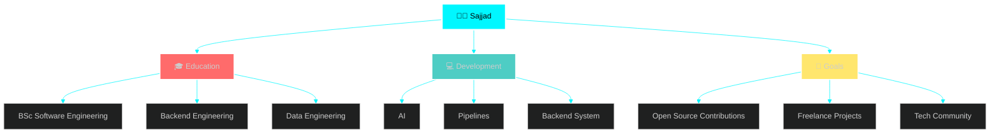

## 📊 GitHub Stats & Trophies

  
  

  

  

## 🛠️ Languages & Tools

  
                              

 
| Area | Status | Priority | 
|------|--------|----------| 
| 🛠 Data Engineer | 🟢 Ongoing | ⭐⭐⭐⭐ | 
| 🚀 Backend Engineering | 🟢 Ongoing | ⭐⭐⭐⭐⭐| 
| 🧠 SFT Engineering | 🟢 Ongoing | ⭐⭐⭐⭐⭐ |

 

## 💼 What I'm Working On

 

## 🔗 Connect with Me

   
   
   
   
 

  

