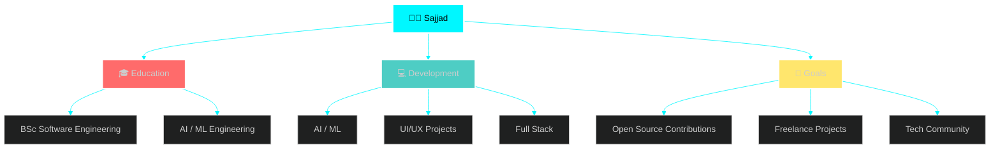

  

## 📌 About Me
- I'm currently learning Software Engineer & AI/ML Engineer

## 🧠 My Focus Areas
- AI/ML Engineer
- Software Engineer
-  📫 How to reach me **sajjadmhd2007@gmail.com**

  

## 🛠️ Languages & Tools

> ## Programming Languages

      

> ## Frontend

     

> ## Backend

   

> ## Database

 

> ## Tools

  

  

## 🏆 GitHub Trophies & Achievements

### 🎯 **Achievement Badges**

<table width="100%" style="border: none;">
<tr>
<td width="50%" style="border: none;">

</td>
<td width="50%" style="border: none;">

</td>
</tr>
<tr>
<td width="50%" style="border: none;">

</td>
<td width="50%" style="border: none;">

</td>
</tr>
</table>

  

 

## 💼 What I'm Working On

 

 
🎯 Current Focus Areas

| Area | Status | Priority |
|------|--------|----------|
| 🚀 Full-Stack | 🟢 In Progress | ⭐⭐⭐⭐⭐ |
| 🤖 AI / ML Engineering | 🟢 Ongoing | ⭐⭐⭐⭐ |
| 🎨 Advanced UI/UX | 🟢 Ongoing | ⭐⭐⭐⭐⭐ |

  

 

### 🔝 Top Contributed Repo

    
  
    

<picture>
  <source media="(prefers-color-scheme: dark)" srcset="https://raw.githubusercontent.com/abozanona/abozanona/output/pacman-contribution-graph-dark.svg">
  <source media="(prefers-color-scheme: light)" srcset="https://raw.githubusercontent.com/abozanona/abozanona/output/pacman-contribution-graph.svg">
  
</picture>

## 🔗 Connect with Me

   
   
   
   
 

-----------------------------------------Stay Tune----------------------------------------

 

 
 

 

  

