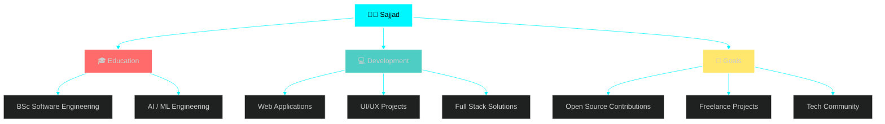

<h1 align="center">Hey  I'm Mohamed Sajjad</h1>
<h3 align="center">Software Engineer & AI/ML Engineer</h3>

## 📌 About Me
- I'm currently learning Software Engineer & AI/ML Engineer

## 🧠 My Focus Areas
- AI/ML Engineer
- Software Engineer

- 📫 How to reach me **sajjadmhd2007@gmail.com**

<h3 align="left">Connect with me:</h3>

<h3 align="left">Languages and Tools:</h3>

                              

## 🏆 GitHub Trophies & Achievements

### 🎯 **Achievement Badges**

<table width="100%" style="border: none;">
<tr>
<td width="50%" style="border: none;">

</td>
<td width="50%" style="border: none;">

</td>
</tr>
<tr>
<td width="50%" style="border: none;">

</td>
<td width="50%" style="border: none;">

</td>
</tr>
</table>

 

## 💼 What I'm Working On

 

### 🎯 **Current Focus Areas**

| Area | Status | Priority |
|------|--------|----------|
| 🚀 Full-Stack | 🟢 In Progress | ⭐⭐⭐⭐⭐ |
| 🤖 AI / ML Engineering | 🟢 Ongoing | ⭐⭐⭐⭐ |
| 🎨 Advanced UI/UX | 🟢 Ongoing | ⭐⭐⭐⭐⭐ |

 

### 🔝 Top Contributed Repo
-

  

<picture>
  <source media="(prefers-color-scheme: dark)" srcset="https://raw.githubusercontent.com/abozanona/abozanona/output/pacman-contribution-graph-dark.svg">
  <source media="(prefers-color-scheme: light)" srcset="https://raw.githubusercontent.com/abozanona/abozanona/output/pacman-contribution-graph.svg">
  
</picture>

 
-----------------------------------------Stay Tune----------------------------------------

  

